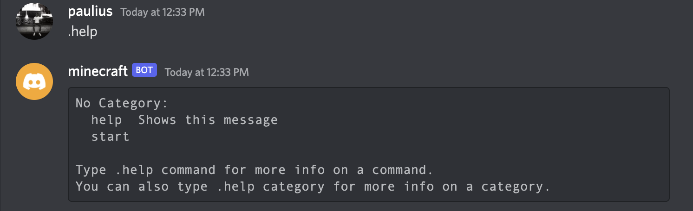
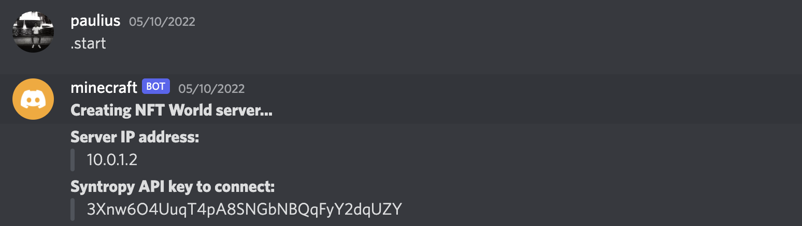
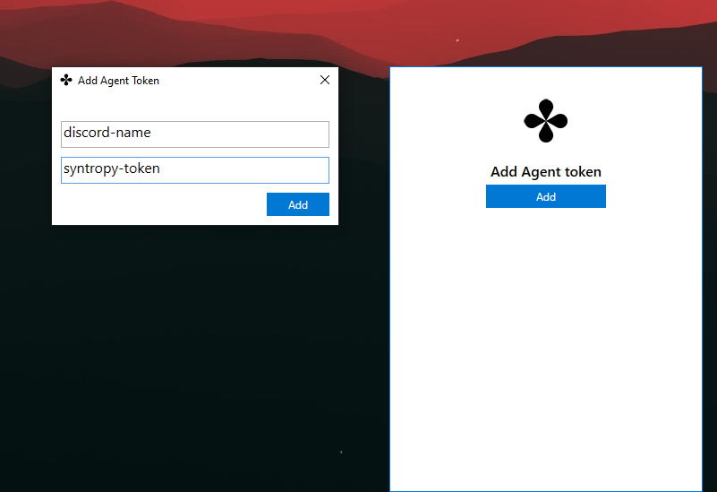
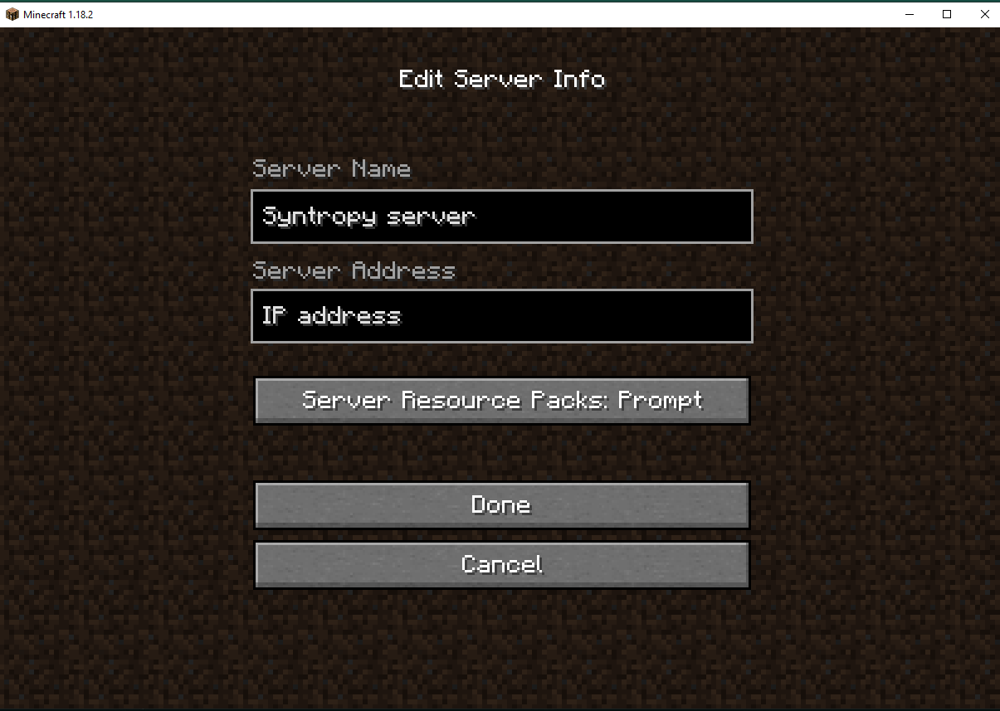

# NFT World integration

## Introduction

The Syntropy Stack is a collection of tools and applications that will help you to automatically set up secure, stable, high performance connections between endpoints. These tools can also help you dynamically create connections between your gameservers (such as NFT World) and your players. This is a simple usecase that can be expanded to usecases such as a self-service platform for customers to order a server that can be securely connected to the players.

## Requirements
- **[Syntropy app](https://docs.syntropystack.com/docs/windows-application)**
- **Minecraft launcher (1.17 version)**
- **Discord**
## How-to
1. You can type `.help` command in the chat to see all available commands

2. Using `.start` command will automatically create an NFT World minecraft server
3. The bot will then provide you `access key` and `server IP` to connect to. **Note:** you will have **5 minutes** to connect before the agent terminates the connection.

4. Setup the **Syntropy Agent** on your machine using the configuration that the Discord bot sent you. **Note:** provide your `Discord name` in the input field.

5. Open **Minecraft launcher** and add a new world with the `IP address` provided by the agent

6. Good luck!